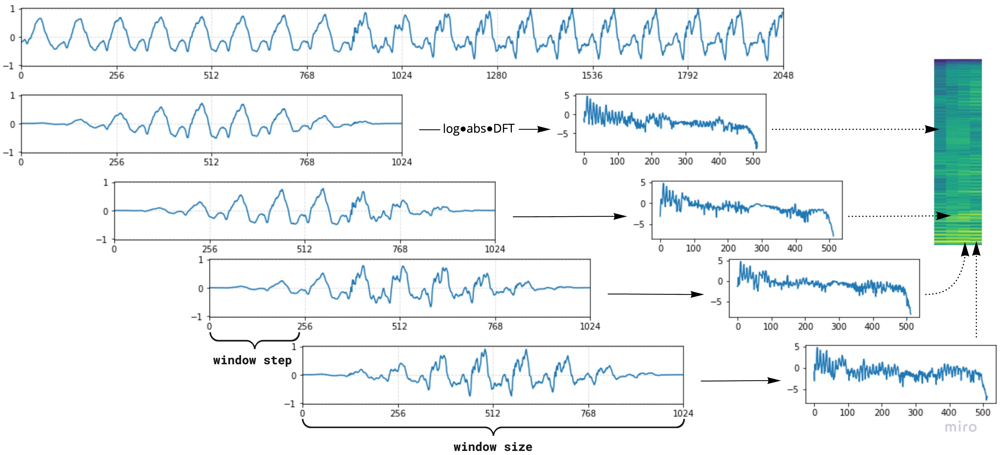

# Seminar 1: Mel-Spectrograms and the Griffin-Lim Algorithm

## Task 1: Mel-Spectrogram (5 points)

As you can see, amplitudes follow a periodic patterns with different frequencies. However, it is very difficult to process these amplitudes directly because there's so many of them! A typical WAV file contains 22050 amplitudes per second, which is already way above a typical sequence length for other NLP applications. Hence, we need to compress this information to something manageable. 

A typical solution is to use __spectrogram:__ instead of saving thousands of amplitudes, we can perform Fourier transformation to find which periodics are prevalent at each point in time. More formally, a spectrogram applies [Short-Time Fourier Transform (STFT)](https://en.wikipedia.org/wiki/Short-time_Fourier_transform) to small overlapping windows of the amplitude time-series:

However, this spectrogram may have extraordinarily large numbers that can break down neural networks. Therefore the standard approach is to convert spectrogram into a __mel-spectrogram__ by changing frequencies to [Mel-frequency spectrum(https://en.wikipedia.org/wiki/Mel-frequency_cepstrum)].

Hence, the algorithm to compute spectrogram of amplitudes $y$ becomes:
1. Compute Short-Time Fourier Transform (STFT): apply fourier transform to overlapping windows
2. Build a spectrogram: $S_{ij} = abs(STFT(y)_{ij}^2)$
3. Convert spectrogram to a Mel basis

## Tasl 2: Griffin-Lim Algorithm (5 points)

In this task you are going to reconstruct the original audio signal from a spectrogram using the __Griffin-Lim Algorithm (GLA)__ . The Griffin-Lim Algorithm is a phase reconstruction method based on the redundancy of the short-time Fourier transform. It promotes the consistency of a spectrogram by iterating two projections, where a spectrogram is said to be consistent when its inter-bin dependency owing to the redundancy of STFT is retained. GLA is based only on the consistency and does not take any prior knowledge about the target signal into account.

This algorithm expects to recover a __complex-valued spectrogram__, which is consistent and maintains the given amplitude $\mathbf{A}$, by the following alternative projection procedure. Initialize a random "reconstruced" signal $\mathbf{x}$, and obtain it's STFT
$$\mathbf{X} = \text{STFT}(\mathbf{x})$$

Then we __discard__ the magnitude of $\mathbf{X}$ and keep only a random phase $\mathbf{\phi}$. Using the phase and the given magnitude $\mathbf{A}$ we construct a new complex value spectrogram $ \mathbf{\tilde X}$ using the euler equation

$$\mathbf{\tilde X} = \mathbf{A}\cdot e^{j\mathbf{\phi}}$$

Then we reconstruct the signal $\mathbf{\tilde x}$ using an __inverse STFT__:

$$\mathbf{\tilde x} = \text{iSTFT}(\mathbf{\tilde X})$$

We update our value of the signal reconstruction:

$$ \mathbf{x} = \mathbf{\tilde x} $$

Finally, we interate this procedure multiple times and return the final $$\mathbf{x}$$.